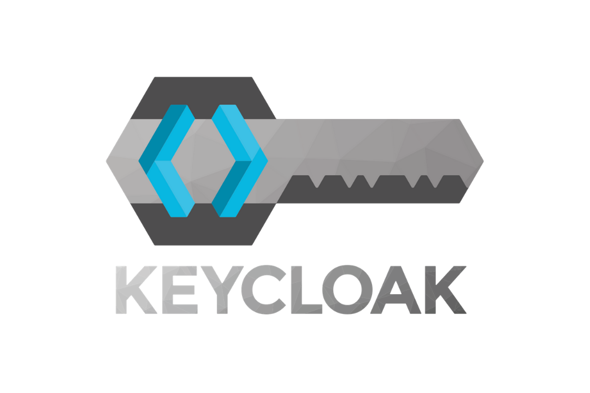

# Keycloak Provider for Codesphere

This repository provides the configuration and deployment scripts to run Keycloak as a native provider on Codesphere. The deployment is configured for a production environment, utilizing a PostgreSQL database backend and Codesphere's Vault for secure secret management.

## Prerequisites

Before deploying this provider, the following infrastructure must be present in your Codesphere landscape:

1. **PostgreSQL Database**: A reachable Postgres instance.
2. **Codesphere Vault**: The following secrets must be provisioned in your workspace or team vault:
   * `kcPgPw`: The password for the PostgreSQL database user.
   * `kcAdminPw`: The password for the initial Keycloak administrator account.

## Environment Variables

Configure the following environment variables within your `codesphere.yaml` or via the Landscape Config Editor:

| Variable | Description | Example |
| :--- | :--- | :--- |
| `PG_JDBC_STRING` | The JDBC connection string for the database. Must use the `jdbc:postgresql://` prefix. Credentials should be omitted from this string. | `jdbc:postgresql://<db-host>:5432/<db-name>` |
| `PG_USER` | The PostgreSQL database username. | `app` |
| `PG_PASSWORD` | Vault reference for the database password. | `${{ vault['kcPgPw'] }}` |
| `KC_BOOTSTRAP_ADMIN_USERNAME` | Username for the initial Keycloak administrator. | `admin` |
| `KC_BOOTSTRAP_ADMIN_PASSWORD` | Vault reference for the administrator password. | `${{ vault['kcAdminPw'] }}` |

## Technical Notes & Troubleshooting

### Admin Bootstrapping
When starting Keycloak in production mode, the standard web-based interface for creating the initial administrator account is disabled ("Local access required" restriction). To bypass this, the `scripts/start.sh` file runs the `bootstrap-admin` command using the `KC_BOOTSTRAP_ADMIN_*` variables prior to executing the `start` command. 

*Note: If a bootstrap user already exists in the target database, attempting to create a new user with the same username will result in a silent failure if error handling is bypassed (`set +e`). Ensure you are bootstrapping a unique username or operating on a clean database schema.*

### Database Connection (JDBC)
Keycloak utilizes Quarkus and requires strict adherence to JDBC connection string standards:
* Use `jdbc:postgresql://`, not `postgres://` or `jdbc:postgres://`.
* Do not append credentials directly to the connection string (e.g., `user:password@host`). Credentials containing special characters can cause parsing failures. Pass credentials strictly via the `--db-username` and `--db-password` flags in the startup script.